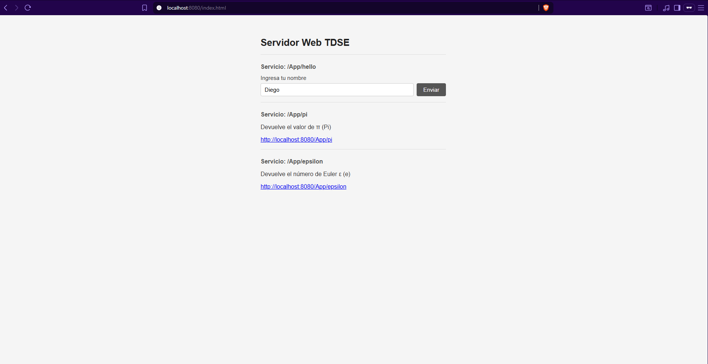
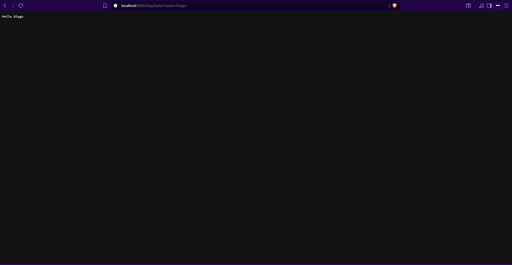
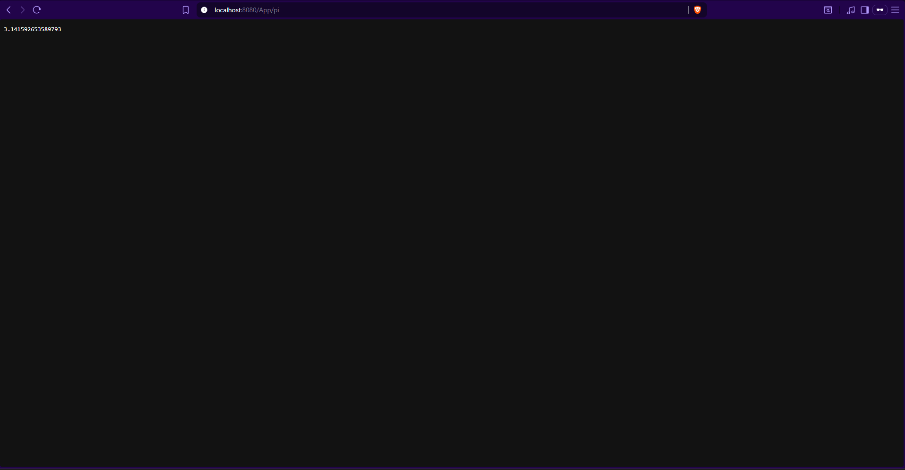

# Servidor Web TDSE — Framework REST en Java

## Código base proporcionado por el profesor

Este proyecto parte del siguiente servidor HTTP básico suministrado en clase (taller 4–7 pm), el cual acepta conexiones TCP y responde peticiones simples:

```java
import java.net.*;
import java.io.*;

public class HttpServer {

    public static void main(String[] args) throws IOException, URISyntaxException {
        ServerSocket serverSocket = new ServerSocket(35000);
        Socket clientSocket = null;
        boolean running = true;

        while (running) {
            System.out.println("Listo para recibir ...");
            clientSocket = serverSocket.accept();

            PrintWriter out = new PrintWriter(clientSocket.getOutputStream(), true);
            BufferedReader in = new BufferedReader(new InputStreamReader(clientSocket.getInputStream()));

            boolean firstLine = true;
            String reqpath = "";

            while ((inputLine = in.readLine()) != null) {
                if (firstLine) {
                    URI requri = new URI(inputLine.split(" ")[1]);
                    reqpath = requri.getPath();
                    firstLine = false;
                }
                if (!in.ready()) break;
            }

            if (reqpath.equals("/pi")) {
                out.println("HTTP/1.1 200 OK\r\n..." + Math.PI + "...");
            } else {
                out.println("HTTP/1.1 200 OK\r\n...My Web Site...");
            }

            out.close(); in.close(); clientSocket.close();
        }
        serverSocket.close();
    }
}
```

A partir de este punto de partida se construyó el framework completo descrito en este documento.

---

## Descripción

Este proyecto extiende un servidor HTTP básico convirtiéndolo en un mini framework web que permite a los desarrolladores registrar servicios REST mediante funciones lambda, leer parámetros de las URLs y servir archivos estáticos directamente desde el classpath, todo sin dependencias externas.

---

## Introducción

El punto de partida fue un servidor TCP simple que aceptaba conexiones HTTP. A partir de ahí, se diseñó una capa de framework que:

- Expone una API de tres métodos: `get()`, `staticfiles()` y `start()`
- Traduce las peticiones HTTP entrantes en objetos `HttpRequest` y `HttpResponse`
- Evalúa si la URL coincide con alguna ruta registrada; si no, intenta servir un archivo estático
- Detecta el tipo MIME automáticamente (HTML, CSS, JS, imágenes)

El resultado es un servidor completamente funcional con una API tan sencilla como:

```java
WebFramework.staticfiles("/webroot");
WebFramework.get("/App/hello", (req, res) -> "Hello " + req.getValues("name"));
WebFramework.start(8080);
```

---

## Funcionalidades

### 1. Registro de rutas con `get()`

```java
WebFramework.get("/App/hello", (req, res) -> "Hello World!");
WebFramework.get("/App/pi",   (req, res) -> String.valueOf(Math.PI));
```

### 2. Lectura de parámetros de la URL con `req.getValues()`

```java
WebFramework.get("/App/hello", (req, res) -> "Hello " + req.getValues("name"));
// GET /App/hello?name=Pedro  →  Hello Pedro
```

### 3. Archivos estáticos con `staticfiles()`

```java
WebFramework.staticfiles("/webroot");
// Sirve: src/main/resources/webroot/index.html, style.css, etc.
```

### 4. App de ejemplo (`App.java`)

```java
public static void main(String[] args) {
    WebFramework.staticfiles("/webroot");
    WebFramework.get("/App/hello",   (req, resp) -> "Hello " + req.getValues("name"));
    WebFramework.get("/App/pi",      (req, resp) -> String.valueOf(Math.PI));
    WebFramework.get("/App/epsilon", (req, resp) -> String.valueOf(Math.E));
    WebFramework.start(8080);
}
```

---

## Arquitectura

### Clases principales

| Clase | Responsabilidad |
|-------|-----------------|
| `HttpServer` | Acepta conexiones TCP, lee la petición HTTP y delega al framework |
| `WebFramework` | Singleton que registra rutas y coordina el despacho de peticiones |
| `HttpRequest` | Parsea la línea de petición; expone `getPath()` y `getValues()` |
| `HttpResponse` | Escribe la respuesta HTTP (texto, archivo binario o 404) |
| `Route` | Par (path, lambda) que representa un endpoint registrado |
| `App` | Punto de entrada de la aplicación de demostración |

### Flujo de una petición

```
Navegador
  │  GET /App/hello?name=Pedro
  ▼
HttpServer  ──► HttpRequest (parsea path y query params)
  │
  ├─ ¿Ruta registrada?  ──► SÍ ──► ejecuta lambda ──► HttpResponse.send()
  │
  └─ NO ──► busca archivo en classpath /webroot ──► HttpResponse.sendFile()
                │
                └─ No existe ──► 404
```

### Estructura del proyecto

```
mi-proyecto-java/
├── src/
│   ├── main/
│   │   ├── java/com/example/
│   │   │   ├── App.java              # Aplicación de ejemplo
│   │   │   ├── HttpServer.java       # Servidor TCP principal
│   │   │   ├── HttpRequest.java      # Parseo del request y query params
│   │   │   ├── HttpResponse.java     # Construcción de respuestas HTTP
│   │   │   ├── Route.java            # Par (path, lambda handler)
│   │   │   ├── WebFramework.java     # Singleton: get(), staticfiles(), start()
│   │   │   ├── URLReader.java        # Utilidad: lectura de URLs
│   │   │   ├── URLParcel.java        # Utilidad: parseo de URLs
│   │   │   ├── EchoServer.java       # Servidor eco de práctica
│   │   │   └── EchoClient.java       # Cliente eco de práctica
│   │   └── resources/webroot/
│   │       ├── index.html            # Página de demo con formulario REST
│   │       └── style.css             # Estilos de la página
│   └── test/java/com/example/
│       └── WebFrameworkTest.java     # 11 tests unitarios (JUnit 4)
├── docs/images/                      # Capturas de pantalla
│   ├── index.png
│   ├── hello.png
│   ├── pi.png
│   └── epsilon.png
├── .gitignore
├── pom.xml
└── README.md
```

---

## Instalación y ejecución

**Requisitos:** Java 17+, Maven 3.6+

```bash
# Compilar y empaquetar
mvn clean package

# Ejecutar
java -jar target/mi-proyecto-java-1.0-SNAPSHOT.jar
```

Salida esperada:

```
=== Web Framework Server started on port 8080 ===
Listo para recibir ...
```

Abrir en el navegador: `http://localhost:8080/index.html`

---

## Endpoints

| URL | Respuesta |
|-----|-----------|
| `http://localhost:8080/index.html` | Página estática con formulario de prueba |
| `http://localhost:8080/App/hello?name=Pedro` | `Hello Pedro` |
| `http://localhost:8080/App/pi` | `3.141592653589793` |
| `http://localhost:8080/App/epsilon` | `2.718281828459045` |

---

## Capturas de pantalla

### Página principal (`/index.html`)


### Endpoint `/App/hello?name=Pedro`


### Endpoint `/App/pi`


### Endpoint `/App/epsilon`


---

## Tests

```bash
mvn test
```

```
[INFO] Tests run: 11, Failures: 0, Errors: 0, Skipped: 0
[INFO] BUILD SUCCESS
```

Los 11 tests cubren: parseo de path y query params, manejo de parámetros ausentes, método HTTP, ejecución de lambdas para cada endpoint, registro y búsqueda de rutas, y configuración de `staticfiles()`.

---

## Autor

- **Nombre:** Diego Alejandro Montes Bonilla
- **Universidad:** Escuela Colombiana de Ingeniería Julio Garavito  
- **Asignatura:** Transformación Digital y Arquitectura Empresarial 
